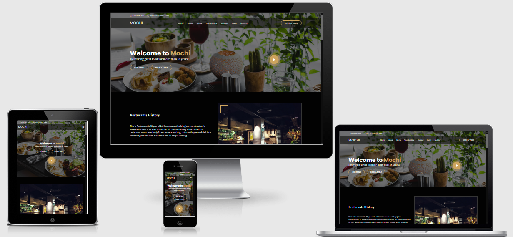
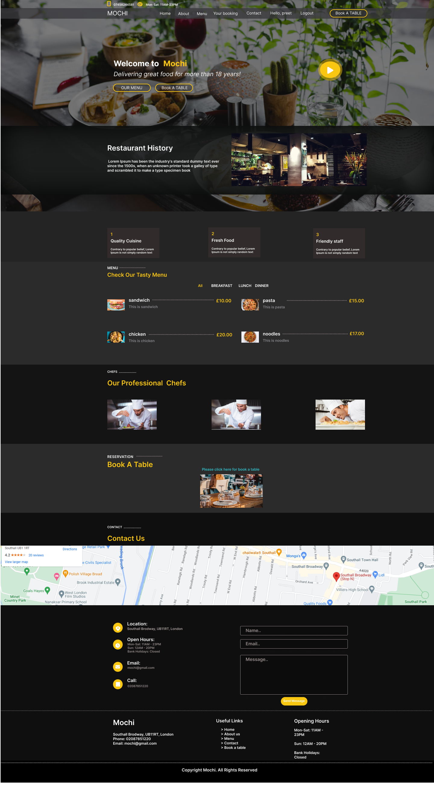
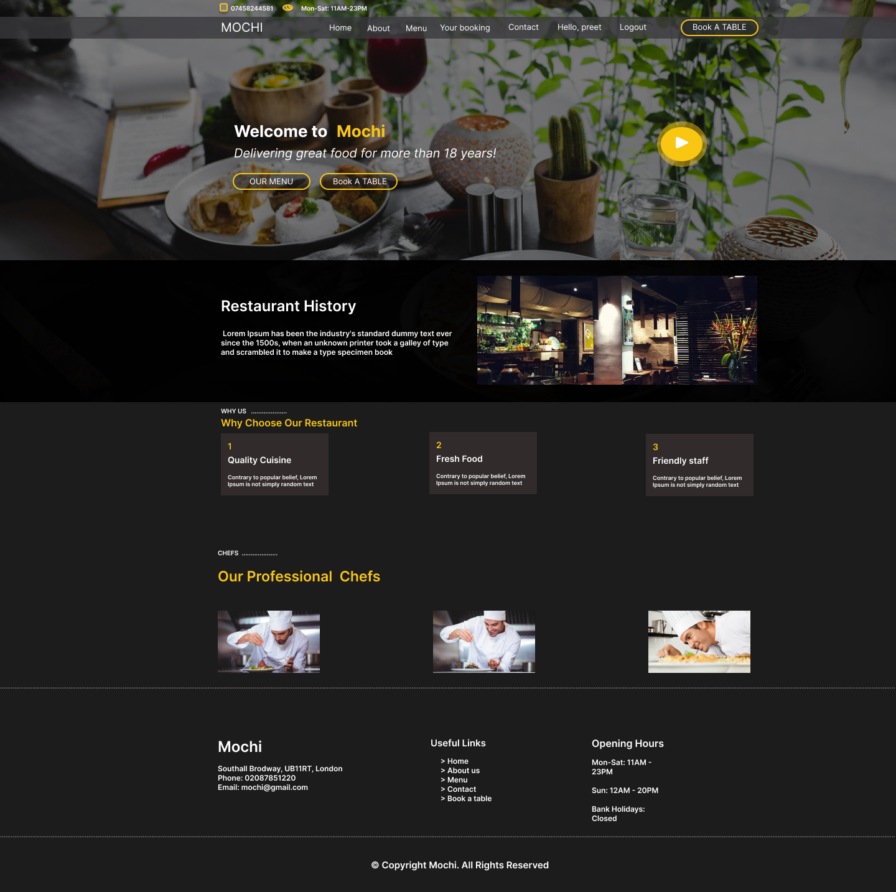
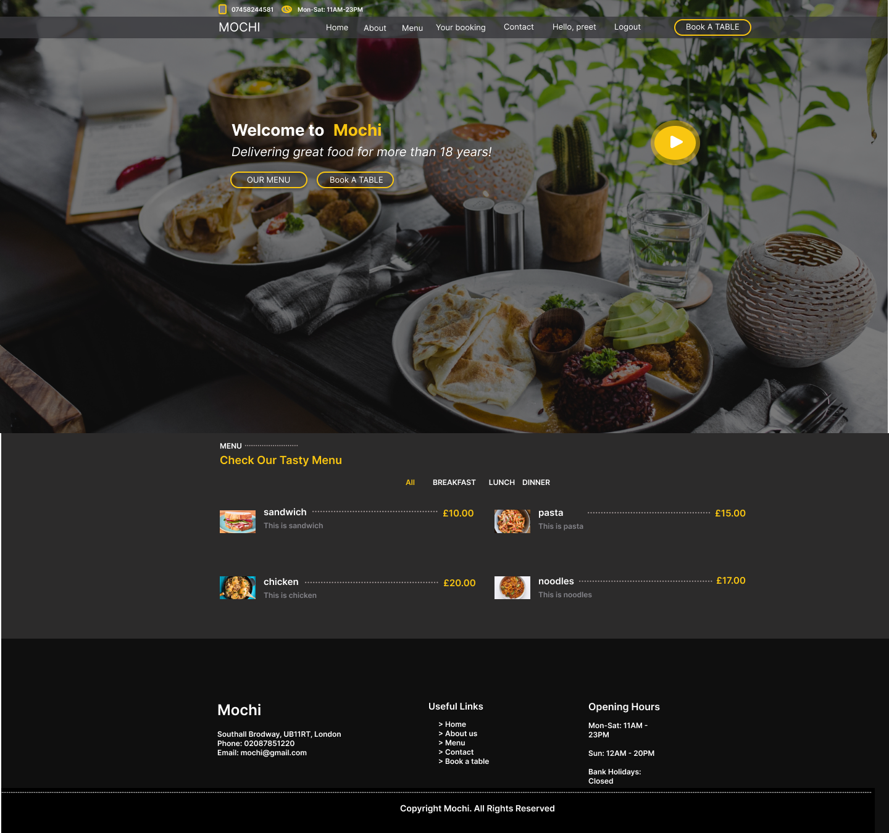
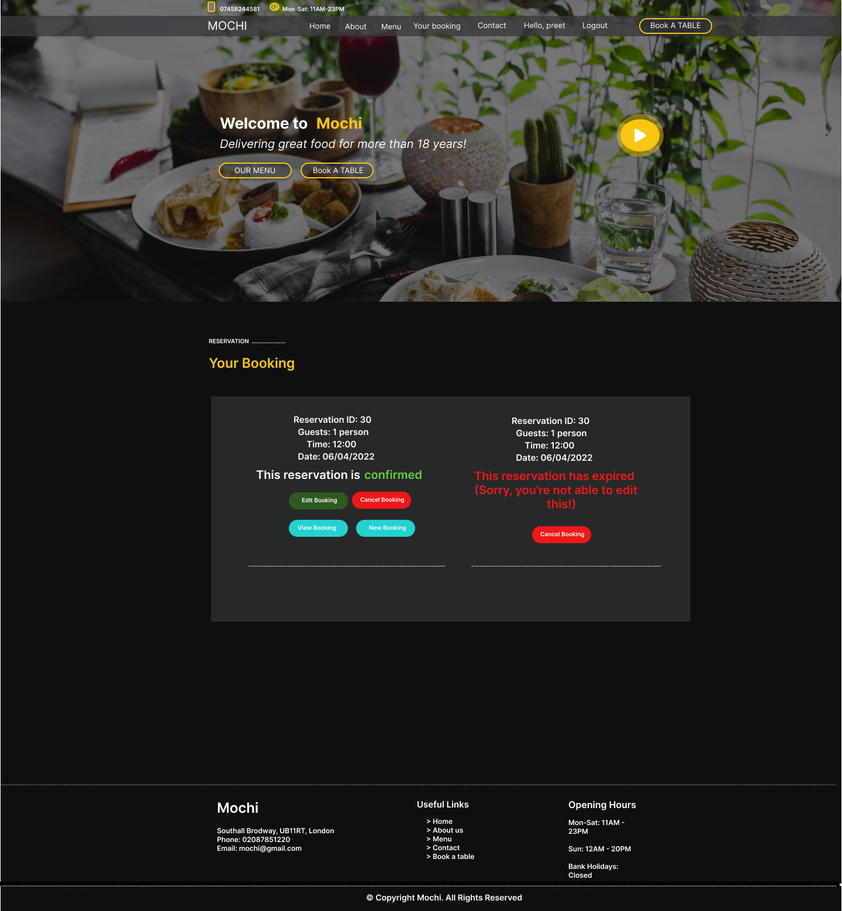
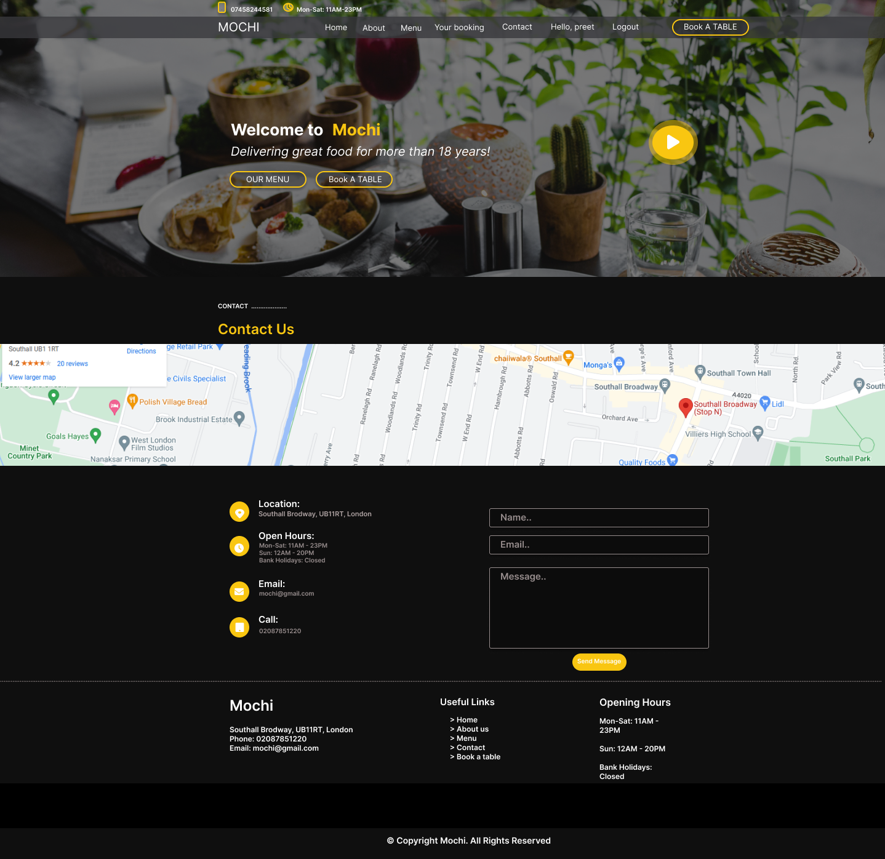
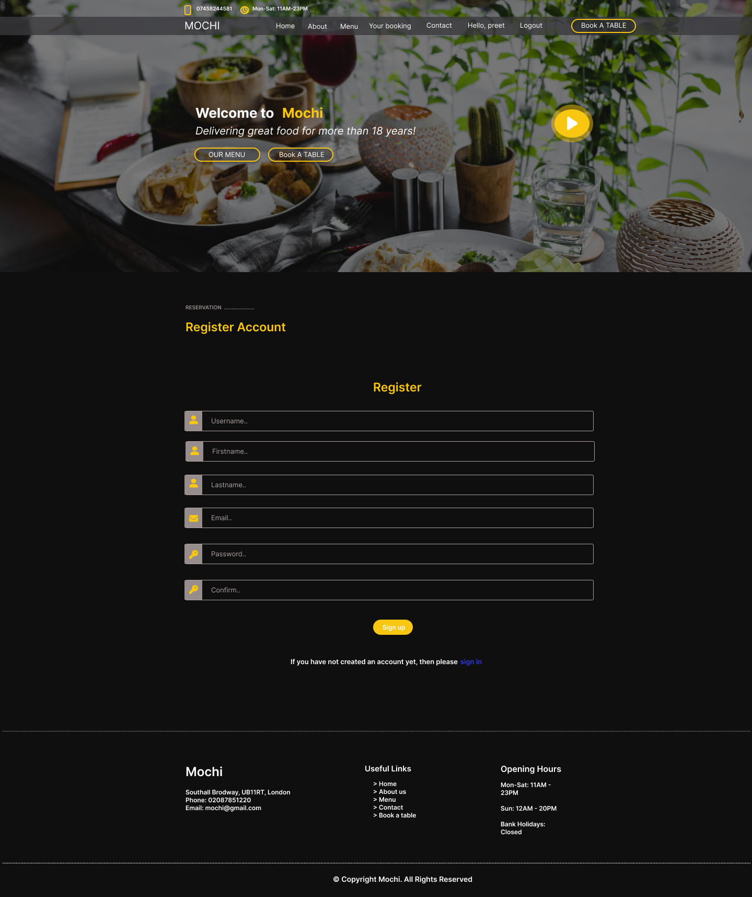
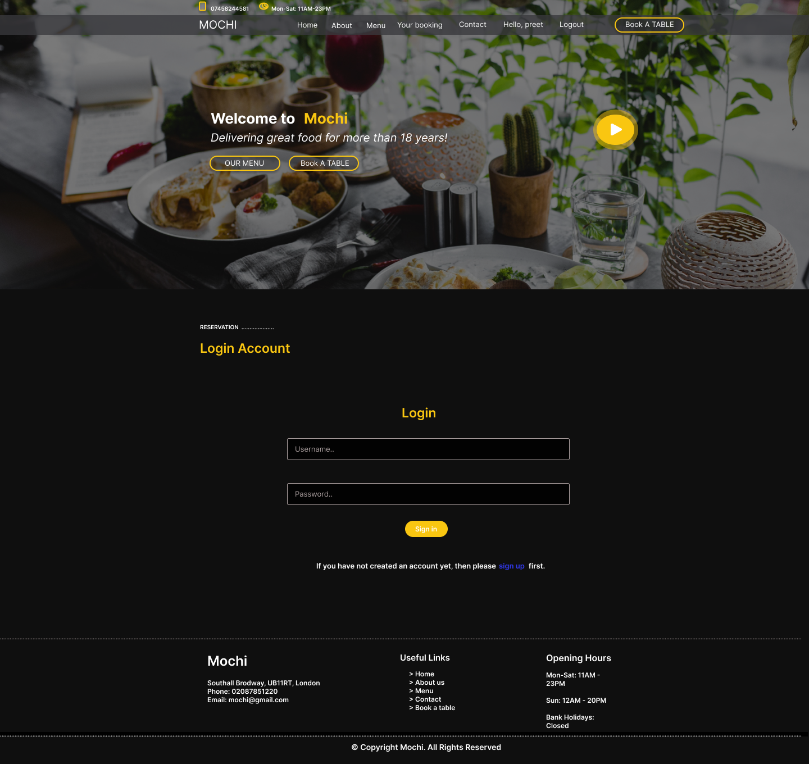
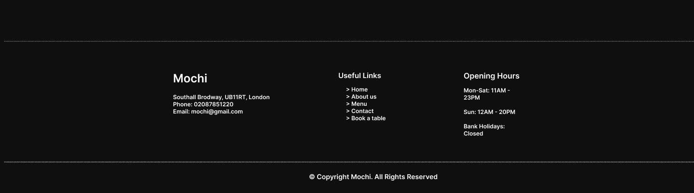

# Mochi Restaurant

[View the live project here](https://mochi-restaurant.herokuapp.com)

## Contents
1. [Introduction](#Introduction)

2. [User Experience](#User-Experience)

3. [Target](#Target)

4. [Design](#Design)

5. [Features](#Features)

6.  [Flowchart](#Flowchart)

7. [Bugs](#Bugs)

8. [Other Features](#Other-Features)

9. [Features Left to Implement](#Feature-Left-to-Implement)

10. [Technologies Used](#Technologies-Used)

11. [Frameworks Libraries and Programs Used](#Frameworks-Libraries-and-Programs-Used)

12. [Testing](#Testing)

    - [Testings.md](assets/testing-file/testing.md)

13. [Deployment](#Deployment)

14. [Make a clone](#Make-a-clone)

15. [Credit](#Credit)

16. [Acknowledgements](#Acknowledgements)

## Introduction

This is my 4th project at code institute.This is restaurant website designed to display to the customers and allow them to make a booking and edit,view and delete the booking.In this website customers need to login or register on the website for booking, otherwise they can't see any booking and the website will take them on login page.This website deployed on heroku.

## User Experience

### Ideal User Demographic
* New users.
* Current users.

### User Stories

#### New users :

* For new/potential user, I have included all the information about the restaurant on one page.
* As a admin user, I can login website to the access the site's backend.
* As a admin user, I can update,delete and accept or reject the reservation.
* As a new/potential user, I can login or register on website to view or edit my bookings.
* As a new/potential user, I can see Breakfat,Lunch and Dinner menu seprately.

#### Current Users :
- As a current user, I can login my account.
- As a current user, I can Edit,View and Cancel my bookings.
- As a current user, I can check my previous booking status.
- As a current user, I can contact to the restaurant regarding my current booking information.
- As a current user, I can see all the new updates about the menu.

## Target

- On the website home page I have added a big background image about the food serving in the resturant, This image push people to come in the restaurant.
- On the website home page I have added a video clip about the restautant service and food, so that people can see everything about the restaurant before book a table.

#### Structure
In this website i used five apps:

1. Aboutus - restaurant history, chefs
2. Menu - menu display
3. Reservation - reservations enquiries & customer management
4. Home - Information of all the pages
5. Contact - users feedback

### Databases

The menu, aboutus and reservation apps require databases to store information so I have built 8 custom models. 

#### Menu
In the menu app i created two models names Meals & Category, these are two models that provide all the information required to display the items as part of the restaurant's menu. Each item has a name, description, price and for how many people.

This model is following this flow diagram:

#### Reservation
There are 3 models in reservation app, Customer, Table & Reservation.These 3 models allow for customer details to be stored, reservation enquiries to be made & managed & also enable availability checks whilst the user is enquiring. 

For each reservation, there will be a customer & table assigned to it. The customer is assigned during the enquiry process and the tables are manage in the backend by the admin user. This model only works if user is login or registerd. Logged in users will have their details with the user email address as this is how they are located in the customer model.

The tables model is used for checking the availablity of the tables in the resturant. This process used by backend admin user, Admin user checks if there is avaiable table in the restaurant then he accept user table request according to the avaliabilty.

This model is following this flow diagram:

#### Aboutus
There are 3 models in aboutus app, AboutUs, Why_Choose_Us and Chef. AboutUs model is used for display the history of the restaurant with image.Why_Choose_Us model is created for show the 3 blocks, One is to read about out staff, Second is to about fresh food and the last one is read about our food quality.Chef model is used for show the information about our chef with chef image, name and social accounts.

This model is following this flow diagram:

 ## Design

 ### Colour Schema
 * I used four colours for the background and content, which are white, yellow, black and dark grey. I have also used a small amount of red for cancel the booking button.
* I chose all the colours I used from [theme waGon](https://themewagon.com/theme-tag/restaurant-template/) website.

#### Typography
* I selected the font I used  from the [Google font](https://fonts.google.com/) website and linked it with my Css file.
* I used three font style system-ui,-apple-system,"Segoe UI",Roboto,"Helvetica Neue",Arial,"Noto Sans","Liberation Sans",sans-serif.

* I have used the font Sans-serif for backup in instances where if the correct link isn’t provided to the css3 file, a font type is still available. If this occurs and the Google font does not work the backup font sans-serif will always work.

#### Imagery
* The images used in this website play vital role in the user experience of the website.
* The images shown on the website have been selected to convience customer to come in the resaurant.
* Image is downloaded free from the [pexels](https://www.pexels.com/search/gym%20and%20fitness/) website.

#### Skeleton
 - I used [Figma](https://www.figma.com/file/jCwcpxiv4ugqY8XK812AA8/Restaurant?node-id=0%3A1) Wireframe for website.

## Features

* ### Header
* ### Home Page
* ### About Page
* ### Menu Page
* ### Your Booking Page
* ### Contact Page
* ### Register Page
* ### Login Page
* ### Footer

### Header
In the header the main logo of the website is on the left hand side, and the navigation links are on the right hand side on all the pages.  On medium sized devices such as tablets the logo stays on the left hand side but the navigation links hide behind the hamburger logo. 

### Tablet Mobile And Desktop

### Home Page
The home page has a big hero image in the back.On the image i added two buttons, one button link with menu and other one link with book a table.Under the hero image there is a section where is a history of the retaurant with a image.Under the history section there is menu section about all the foods.Under the menu section there is a form section for Email, Phone number, Address , restaurant Email and a link bar where the user can navigate to all the pages, a  google map of the restaurant location is also featured.

### About Page
The about page has also big background image.Under the image one history section of restaurant with a small image.Under the history section i added a section for why choose our restaurant, in this section there are three blocks,one block is about Quality Cuisine, and the other one is about Fresh Food, and the last one is about Friendly staff.At the last, there is a our professional chefs section.In this section, there are also three blocks, each block has a chef image with their name and with their social media accounts.

### Menu Page
The menu page has a section of menu about Dinner, Lunch and Breakfast.In this menu customer can see all the the detail about any food with price as well.

### Your Booking Page
In the booking page there is a section about your booking. First you have to login or register your name because without login user can't see thier booking.After login users can see their booking if they request for booking in past but if there is no any booking then this page will take them in book a table section.Users can View, Edit and Cancel their bookings.

### Contact Page
The contact page has a background image and under the image a big map where users can see location of the restaurant.Under the map there is a contact section, In this section users can see restaurant email, phone number and opening hours.On right side this section there is form for contact the restaurant where users can send email and their feedbacks.

### Register Page
In the register form, There is a register account section, Where users will get a nice form for register their account. Under this form i give a link for sign in if user has already a account.This form is validate if user doesn,t add valid email or name then user will see a error message on top of the form.

### Login Page
In the login page, Bascally there is a section about login, If user already registerd then then he can login his account.But if user doesn't has account then i gave a link for register that's link is under the login form.When users login or registerd then they can see their name on top of the navbar.

### Footer
A footer is featured on the bottom of every page on the website. The footer has a all the detail about the restaurant.In the middle has links of all the pages.On the right side has details about restaurant opening hours.At the bottom has a social media heading and the following five social media icons; Facebook, Linked in, Twitter, Instagram and skype. Each Icon is linked directly with the corresponding website.

## Bugs
* one bug is when user send email, Contact form shows a error (Network is unreachable) with SMTP. It is working with (backend console).I tried to find out the solution on slack, stackoverflow and on goole but i coundn't get any solution.

## Issue Left
* Getting error when i try to send email with SMTP.

## Other Features
* The logo is linked to the home page when the user will click on the logo it will take them to the home page.
* On the form page, navigation bar and email have a hover option. When the user will hover their mouse over it, it will show a different colour. This makes it easier to understand for the user that this is clickable link.

### Feature Left to Implement

* Customer can pay bill only with debit, credit card or paypal.The reason why didn't implement this is because I need to use third party libaries for this but this project only uses reservation. 

## Technologies Used

### Languages Used
* [HTML5](https://en.wikipedia.org/wiki/HTML5)
* [CSS3](https://en.wikipedia.org/wiki/CSS)
* [Python](https://en.wikipedia.org/wiki/Python_(programming_language))
* [Javascript](https://en.wikipedia.org/wiki/JavaScript)
* [Jquery](https://en.wikipedia.org/wiki/JQuery)

### Frameworks Libraries and Programs Used

* [Django](https://www.djangoproject.com/)
  * Django is the framework that has been used to build the over project and its apps.

* [Bootstrap](https://getbootstrap.com/)
  * Used for creating responsive design.

* [Font Awesome](https://fontawesome.com/ "Link to FontAwesome")
  * Fonts awesome just used to import all the icons in the website.

* [Google Fonts](https://fonts.google.com/ "Link to Google Fonts")
  * Google fonts was used to import the google style fonts in css like Lato, Oswald and sans-serif.

* [Git](https://git-scm.com/ "Link to Git homepage")
  * Gitpod was used for writing the code in the terminal it was also used to commit and push the code in GitHub.

* [GitHub](https://github.com/ "Link to GitHub")
  * GitHub was used to store the data which was pushed by Gitpod.

* [Gitpod](https://www.gitpod.io/)
    * Used as the development environment.
* [Heroku](https://dashboard.heroku.com/apps)
    * Used to deploy my application.

* [Figma](https://www.figma.com/ "Link to Figma homepage")
  * Figma was used to create the wireframe of the project before starting code on the terminal.

* [Cloudinary](https://cloudinary.com/)
    * Used to store all of my static files and images.

* [Favicon.io](https://favicon.io/)
    * Used to create favicon's for my website

* [Am I Responsive?](http://ami.responsivedesign.is/# "Link to Am I Responsive Homepage")
  * Am I Responsive was used to see if project is responsive on different types of devices.

- [W3C Markup Validation Service](https://validator.w3.org/) 
    - Used to validate all HTML code written and used in this webpage.
* [W3C CSS Validation Service](https://jigsaw.w3.org/css-validator/#validate_by_input)
    * Used to validate all CSS code written and used in this webpage.
* [JSHint](https://jshint.com/)
    * Used to validate JS code.

* [SQLite](https://www.sqlite.org/index.html)
    * I have SQLite to run my database tests locally.

* [PostgreSQL](https://www.postgresql.org/)
    * I have used Heroku's PostgreSQL relational database in deployment to store the data for my models.

## Testing
The testing process can be found [here](assets/testing-file/testing.md)

## Deployment

### Github Pages
To deploy a Django application, The following options were used:
1. Click the `Use This Template` button.
2. Add a repository name and description.
3. Click the `Create Repository from Template` to create your repository.
4. To create a Gitpod workspace you then need to click `Gitpod`, this can take a few minutes.
5. When you want to open your project you can go in github and click on your repository then click on gitpod, or you can open with gitpod workspace as well.
6. when you change or write down new things you have to commit your work in github, use the following commands to make your commits:
   * `git add .`: adds all modified files to a staging area
    * `git commit -m "A message explaining your commit"`: commits all changes to a local repository.
    * `git push`: pushes all your committed changes to your Github repository.

### Heroku Pages
This site was deploy via Heroku.

This project was developed using a template provide by code institute however the template was upgraded to improve its functionality, which you can see in the commit.

To deploy this project on Heroku I used followed these steps:

1. [Login](https://dashboard.heroku.com/apps) into Heroku.

2. In the main Heroku dashboard select ‘New’in the top right corner.

3. In the drop down, menu select ‘Create New App’.

4. Give a name related your project. I gave hangman-games to my project.

5. When you see green text with your project name then press ‘create app’button.

6. From the dashboard select ‘setting’option.

7. After select setting option scroll down in the config setting. Select the config vars section This will display the current config vars for the app, there should be nothing already there.

8. After config var select Buildpacks option which is located under the config vars option.

9. In the buildpacks select python pack first save it then repeat select nodejs pack and save it.

10. After this scroll up and select ‘Deploy’ option.

11. In the ‘deploy’ option select ‘GitHub’ option to select your project which one you want to deploy on Heroku, choose your project and connect to the Heroku.

12. After connecting your project to Heroku scroll down on Automatic Deploys button.

13. This will ensure whenever you change something in the repo and push the changes to GitHub, Heroku will rebuild the app. If you select this manually you can manually deploy options further down. For this project, I did Automatic Deployment to enable me to check changes I made to the app as I developed it.

14. Heroku will now build the app for you. Once it has completed the build process you will see a 'Your App Was Successfully Deployed' message and a link to the app to visit the live site.

### Make a Clone

1. [Login](https://github.com/)

2.	Click on Your Repository option and select your project

3.	Click on the code dropdown menu.

4.	To clone the repository using HTTPS, click "Clone with HTTPS", and copy the link.

5.	In your local IDE open the Git Bash terminal.

6.	Change the current working directory to the location where you want the cloned directory to be made.

7.	Type git clone, and then paste the URL you copied in Step 3.

           git clone https://github.com/USERNAME/REPOSITORY

8.	Press Enter. Your local clone will be created.

### Forking a Repository
1.	[Login](https://github.com/) into GitHub.

2.	On the top right, click the fork button.

3.	You will get a copy of the repository in your GitHub account.

## Credit

### Content
* All content Ideas were taken from researching restaurant using Wikipedia.

### Food Menu
* Food images,heading and description were taken from [wasabi](https://www.wasabi.uk.com/) and [Mochi Sushi ](https://www.mochisushitx.com/)

### Code

* [Django models](https://www.youtube.com/watch?v=EI02wQ51GjA&list=PLBTOBXTz1YFZK0moSgoZq93V_AdvrUGSj)
* [Testing](https://www.youtube.com/watch?v=0MrgsYswT1c)
* [Coverage](https://coverage.readthedocs.io/en/6.2/)
* [Gmail SMTP](https://www.youtube.com/watch?v=TZL-WFzvDJg)
* [View Booking](https://www.youtube.com/watch?v=EX6Tt-ZW0so&t=18s)
* [Update Booking](https://www.youtube.com/watch?v=EX6Tt-ZW0so&t=18s)
* [Cancel Booking](https://www.youtube.com/watch?v=EX6Tt-ZW0so&t=18s)
* [Access only login user](https://stackoverflow.com/questions/63602116/django-show-the-content-of-the-model-as-per-the-current-user-logged-in)
* [Login Form](https://www.youtube.com/watch?v=tUqUdu0Sjyc&t=990s)
* [Register Form](https://www.youtube.com/watch?v=tUqUdu0Sjyc&t=990s)
* [Compare date with booking date](https://stackoverflow.com/questions/67896192/comparing-dates-in-django)

### Media
* Some images download free from [pexels](https://www.pexels.com/search/gym%20and%20fitness/).

* The website template i downloaded free from [theme waGon](https://themewagon.com/theme-tag/restaurant-template/) website

## Acknowledgements
* I would especially like to thank my wife, who helped me by giving me some ideas regarding my website. She motivated me to finish this project to the best of my ability.
* Lastly I would like to thank my mentor Seun, she helped during the whole process of the project.